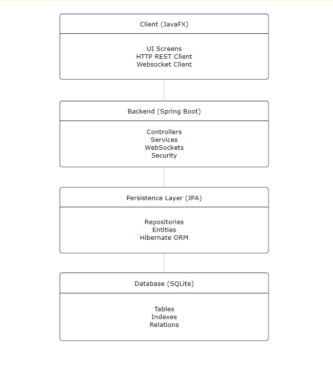
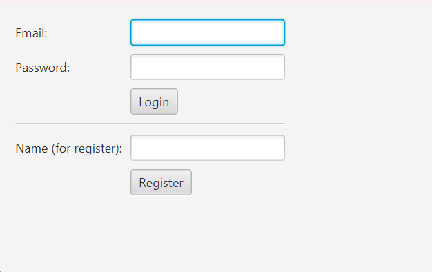
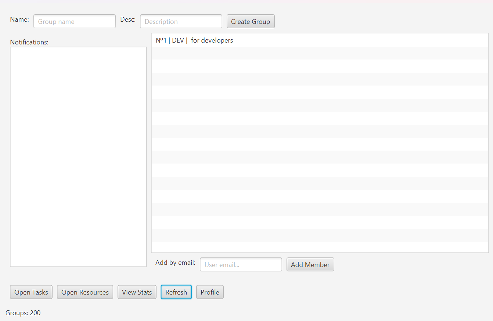
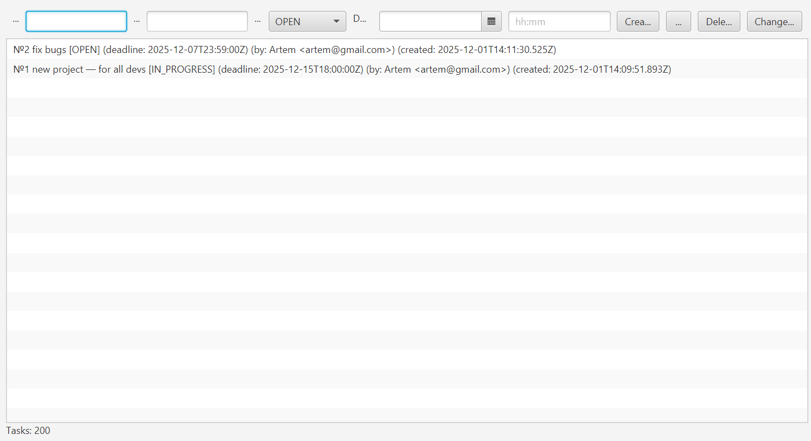
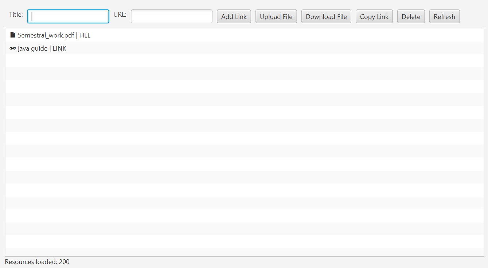
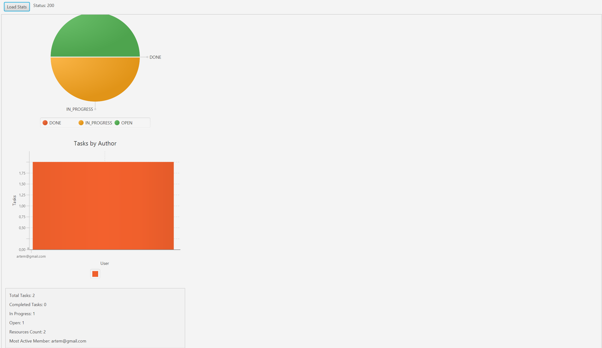
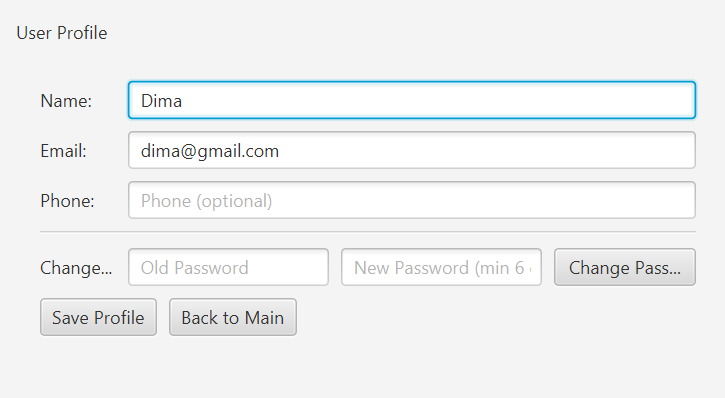

Collaborative Study Platform — Documentation

##1. Project Overview and Application Goals
Collaborative Study Platform is a desktop application designed to support teamwork among students. It provides a unified environment for communication, task organization, file sharing, and activity tracking.
Main goals:
- Improve collaboration within study groups
- Enable real-time communication and notifications
- Centralize tasks, resources, and group information
- Provide an intuitive and accessible UI for non-technical users
##2. System Architecture (Diagram + Layer Explanation)
Frontend (JavaFX 17):
- JavaFX desktop UI
- Multiple screens for all features
- Communicates via REST and WebSocket
Backend (Spring Boot 3.3.0, Java 21):
- REST API provider
- Real-time WebSocket backend
- Business logic layer
Database (SQLite):
- Stores users, tasks, groups, resources, chat messages

##3. Database Model (ER Diagram)
Entities:
- USER
- GROUP
- MEMBERSHIP
- TASK
- RESOURCE
- CHAT_MESSAGE
4. REST API & WebSocket Endpoints Documentation
REST API Summary:
Auth, Groups, Tasks, Resources
WebSocket Endpoint:
ws://localhost:8080/ws/groups/{groupId}
Event Types:
- TASK_CREATED
- TASK_UPDATED
- RESOURCE_ADDED
##6. Challenges and Solutions

Authentication: JavaFX clients do not handle browser-style sessions automatically. Solution: Added Spring Security session-based authentication and implemented cookie handling on the client side.

Real-Time WebSockets: The application required instant updates across multiple users and groups. Solution: Implemented a custom WebSocket endpoint and a session registry to broadcast updates efficiently.

SQLite Dialect: SQLite is not fully supported by Hibernate, causing issues with schema generation and timestamps. Solution: Added a custom SQLite dialect and adjusted entity types for clean database mapping.

JavaFX Threading: Network operations freeze the UI if executed on the JavaFX Application Thread. Solution: Used background threads for I/O and Platform.runLater() for safe UI updates.

7. Use of AI — What Helped, What Required Manual Work
AI helped with: debugging, structure, documentation.
Manual tuning needed for: WebSocket config, DB logic, UI.

1. UI Screenshots & Descriptions
Login/registration Screen

## Login/registration Screen

Description:
The Login screen allows users to securely access the platform using their username and password. Features include input validation, error messages for incorrect credentials, and registration.

## Main Screen

Central navigation hub. Contains buttons for Tasks, Resources, WS Notifications, Statistics, Profile and Task Creation..
Tasks Screen

## Tasks Screen

Displays the list of group tasks. Supports creation, deleting, status updating, and real-time WebSocket synchronization.

## Resource Screen

Allows uploading files and adding external links. Supports filtering and real-time updates.
Statistics Screen

## Activity Screen

Shows activity analytics: tasks created, tasks completed, in progress and open, resources uploaded.

## Profile editing

Displays and edits user's personal information: username, email and password.
